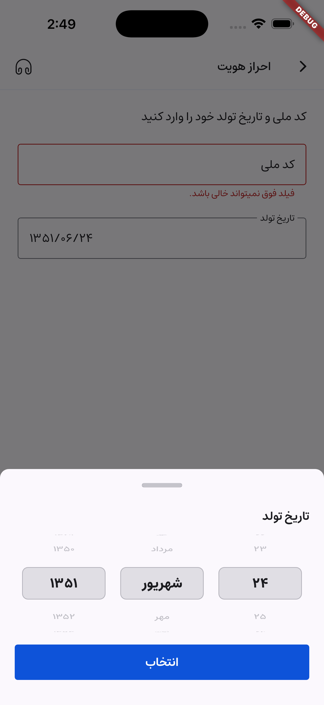
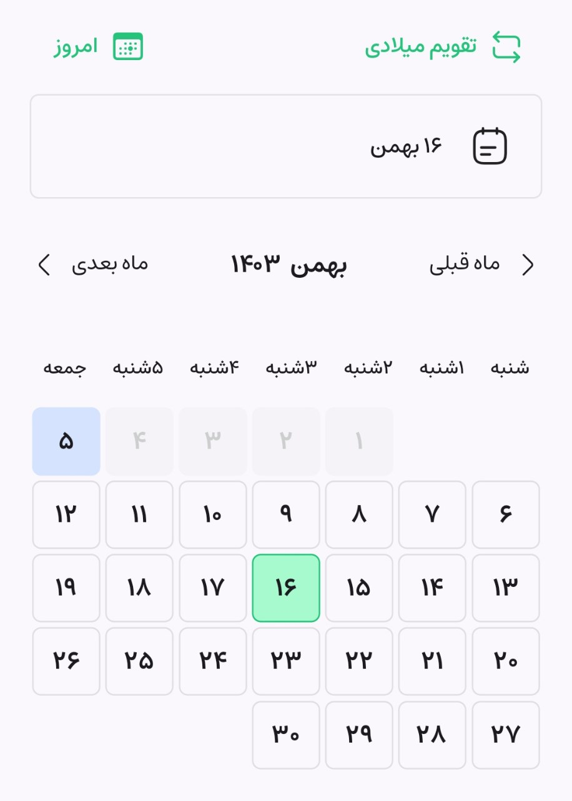
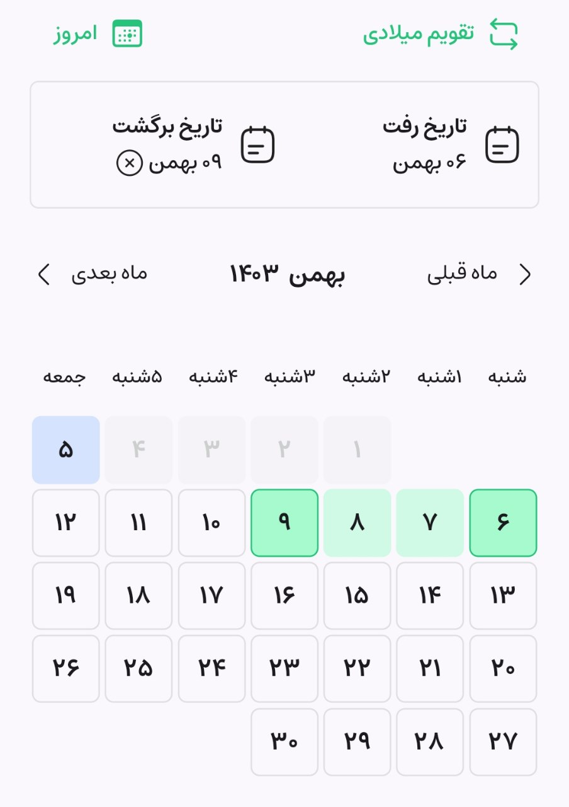

# Custom Date Picker

A fully customizable date picker for Flutter that supports both **Jalali** and **Gregorian** calendars.  
Now includes a new **Simple Date Picker** mode with Cupertino-style scrolling wheels.

---

## Features

- **Dual Calendar Support**: Switch seamlessly between Jalali (Persian) and Gregorian calendars.
- **Single or Range Selection**:
  - Single Date: Choose one date.
  - Range: Select a start and end date.
- **Multiple Picker Modes**:

  - **Complex Mode**: Full-featured month grid picker (single or range).
  - **Simple Mode**: Minimalist Cupertino-style scroll picker.
- **Customizable Appearance**:
  - Modify colors, borders, day items, and more to match your theme.
- **Dynamic Prices**: Display additional data, like prices, for specific days.
- **Mode Interchangeability**: Toggle between single and range modes dynamically.
- **Today Button**: Quickly jump to the current date.
- **Next/Previous Navigation**: Navigate through months with ease.
- **Custom Day Items**: Define your own day widgets for selected, unselected, disabled, and current days.

---

## Installation

Add this package to your `pubspec.yaml`:

```yaml
dependencies:
   dual_custom_date_picker: ^1.3.0
```

Then run:

```bash
flutter pub get
```
---

# Usage

## 🆕 Simple Date Picker (Minimal Mode)

### Overview

A lightweight, scroll-based date selector built with Cupertino pickers.
Perfect for dialogs, forms, and birthdate selection.

### Example

```dart
import 'package:dual_custom_date_picker/dual_custom_date_picker.dart';

SimpleDatePicker(
  currentMonth: DateTime.now(),
  initialDate: DateTime(1900, 1, 1),
  lastDate: DateTime.now(),
  pickerType: PickerType.jalali, // or PickerType.dateTime
  selectedItemBackgroundColor: Colors.grey, // optional highlight border color
  selectedItemStyle: const TextStyle(
    fontWeight: FontWeight.bold,
    color: Colors.deepOrange,
  ),
  itemStyle: const TextStyle(color: Colors.black87),
  selectDateButtonText: const Text('انتخاب تاریخ'),
  selectDateButtonStyle: ButtonStyle(
    backgroundColor: WidgetStatePropertyAll(Colors.deepOrange),
  ),
  clearDateButton: OutlinedButton(
    onPressed: () {},
    child: const Text('حذف'),
  ),
  onDateSelected: (selected) {
    print('Selected date: $selected');
  },
)
```

### Features

* Three synchronized wheels (Year, Month, Day).
* Fully localized (Jalali and Gregorian).
* `initialDate` and `lastDate` limit the scrollable range.
* Style customization:

  * `selectedItemStyle`, `itemStyle`, `selectedItemBackgroundColor`
  * `selectDateButtonText`, `clearDateButton`
  * `itemHeight` for picker height control.
* Ideal for small-space date inputs.

## Props & Configuration

| Name                          | Type                  | Description                                       |
| ----------------------------- | --------------------- | ------------------------------------------------- |
| `datePickerMode`              | `PickerMode`          | Picker mode: `single` or `range`.                 |
| `datePickerType`              | `PickerType`          | Calendar type: `jalali` or `dateTime`.            |
| `onDateSelected`              | `Function(DateTime?)` | Callback for single date selection.               |
| `initialDate`                 | `DateTime?`           | Minimum selectable date.                          |
| `lastDate`                    | `DateTime?`           | Maximum selectable date.                          |
| `currentMonth`                | `DateTime?`           | Initial month displayed.                          |
| `selectedItemStyle`           | `TextStyle?`          | Style for the selected item in Simple Picker.     |
| `itemStyle`                   | `TextStyle?`          | Default item text style.                          |
| `selectedItemBackgroundColor` | `Color?`              | Highlight color or border color of selected item. |
| `selectDateButtonText`        | `Widget?`             | Custom widget for the “Select” button text.       |
| `selectDateButtonStyle`       | `ButtonStyle?`        | Button style for “Select” button.                 |
| `clearDateButton`             | `Widget?`             | Optional button to clear the selection.           |
| `itemHeight`                  | `double?`             | Height of each picker column.                     |

---

## 📸 Screenshots

### Simple Date Picker

---

## 📅 Complex Date Picker (Grid Mode)

```dart
import 'package:custom_date_picker/custom_date_picker.dart';

CustomDatePicker(
  onDateSelected: (selectedDate) {
    print('Selected Date: $selectedDate');
  },
  datePickerMode: PickerMode.single,
  datePickerType: PickerType.jalali, // or PickerType.dateTime for Gregorian
)
```

### Range Selection Example

```dart
CustomDatePicker(
  datePickerMode: PickerMode.range,
  rangeDates: (null, null), // Initial range dates
  onRangeDateSelected: (startDate, endDate) {
    print('Start Date: $startDate');
    print('End Date: $endDate');
  },
)
```

### Advanced Example with Customization

```dart
CustomDatePicker(
  currentMonth: DateTime.now(),
  initialDate: DateTime(2023, 1, 1),
  lastDate: DateTime(2024, 12, 31),
  onFetchPrices: (month) {
    print('Fetch prices for: $month');
  },
  prices: ['\$100', '\$120', '\$90'], // Example prices
  datePickerType: PickerType.jalali,
  selectedDayColor: Colors.blue,
  primaryColor: Colors.orange,
  needToShowTodayButton: true,
  needToShowChangeCalenderMode: true,
  onDateSelected: (date) {
    print('Selected Date: $date');
  },
  onRangeDateSelected: (start, end) {
    print('Selected Range: $start to $end');
  },
  onChangePickerMode: (newMode) {
    print('Changed mode to: $newMode');
  },
)
```

---

## Props & Configuration

### Required Parameters

| Name                 | Type                                    | Description                           |
|----------------------|-----------------------------------------|---------------------------------------|
| `onDateSelected`     | `Function(DateTime?)`                  | Callback for a single date selection.|
| `datePickerMode`     | `PickerMode`                           | Selection mode: `single` or `range`. |
| `datePickerType`     | `PickerType`                           | Calendar type: `jalali` or `dateTime`.|

### Optional Parameters

| Name                     | Type                                       | Description                            |
|--------------------------|--------------------------------------------|----------------------------------------|
| `currentMonth`           | `DateTime?`                               | Initial month to display.              |
| `initialDate`            | `DateTime?`                               | Minimum selectable date.               |
| `lastDate`               | `DateTime?`                               | Maximum selectable date.               |
| `rangeDates`             | `(DateTime?, DateTime?)?`                 | Initial start and end dates for range. |
| `onRangeDateSelected`    | `Function(DateTime?, DateTime?)?`         | Callback for range date selection.     |
| `onChangePickerMode`     | `Function(PickerMode)?`                   | Callback when the selection mode changes. |
| `prices`                 | `List<String>?`                          | Additional data for days (e.g., prices). |
| `onFetchPrices`          | `Function(DateTime)?`                    | Fetch prices when the month changes.   |

### Appearance Customization

| Name                     | Type              | Description                            |
|--------------------------|-------------------|----------------------------------------|
| `selectedDayColor`       | `Color?`          | Background color for the selected day. |
| `currentDayColor`        | `Color?`          | Background color for the current day.  |
| `defaultDayColor`        | `Color?`          | Default day background color.          |
| `primaryColor`           | `Color?`          | Primary color for buttons and icons.   |
| `textColor`              | `Color?`          | Default text color.                    |


## 📸 Screenshots

### Complex Date Picker

| Single Date Picker | Range Date Picker |
|--------------------|------------------|
|  |  |


---

## Additional Features

- **Custom Day Widgets**: Override default day widgets with `DayItemSection`.
- **Multi-language Support**: Adjusts text direction for RTL (e.g., Persian) or LTR (e.g., English).

---

## License

This project is licensed under the MIT License. See the [LICENSE](LICENSE) file for details.
